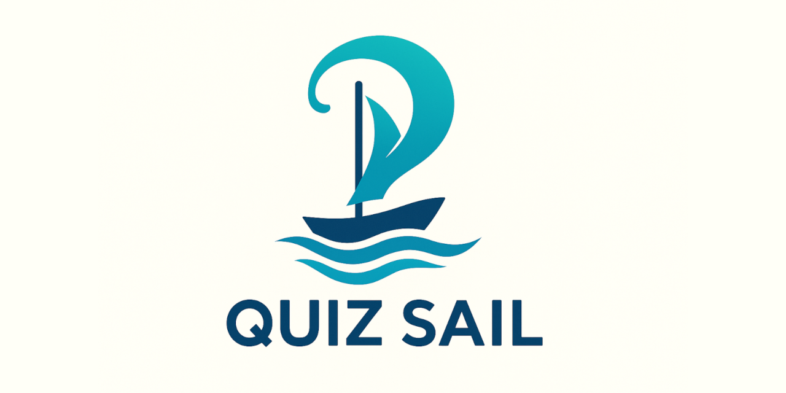

# QuizSail 2.0
Test Prep Engine, forked from [jmatzen](https://github.com/jmatzen/quizsail). 

I started to need additional functionality as I started to utilize this for certification exams for both Salesforce and other industry certs like CompTIA. I needed a way to scrape questions from a book and create the proper json files, especially when the questions and answers were on different pages. I also needed edit functionality for the quiz and make it handle code blocks. Other features were added over time out of need or request. 

#### QuizSail is a test prep engine
The test prep engine uses a technique called *assumed competency*.  This technique assumes that if you answer the question correctly the first time that you already know the answer. Because of this, it's running on sort of an honor system, so if the user is not sure what the answer is they should not enter any answer at all instead of guessing.

QuizSail's competency system works by holding a certain number of questions from the pool in-flight.  Once the user has correctly answered a question in the in-flight state so many times in a row, the question is moved to the completed state and is not asked again.  As long as the in-flight pool is full, the next question to appear is randomly selected from the questions in the pool that aged the most so that the same question is not likely to be asked twice in a row.

## List of updates for QuizSail 2.0

#### Generate Quizzes With Questions Marked as Incorrect
At the end of each session, options are given to generate a new quiz with:  

🔥 Questions marked incorrect on the first try  
🔥 Questions marked incorrect 2x during the session  
🔥 Questions marked incorrect 3x during the session  
🔥 Question marked incorrect 4 or more times during the session  
🔥 All questions  
🔥 All questions weighted (questions are added the number of times they were answered incorrectly)  

#### Refresh Quiz
🔥 Log functionality that keeps track of all successful first attempts for the last 10 sessions.  
🔥 Option to prune logs once there are 5 in case there are sessions that were deleted prior to starting a new one.  
🔥 Option to refresh a quiz after 5 sessions: removes the questions that were answered correctly on the first try at least 3 out of the last 5 sessions. Original quiz is moved to the "retired" directory.  

#### Review Mode
✅ Scroll through all questions, answers and explanations. 
✅ Add or modify current explanation  
✅ Modify current answer  
✅ Modify current question  
✅ Modify current choice  
✅ Add a new choice  

#### File Management
📁 Retire quizzes  
📁 Un-retire quizzes  
📁 Delete quizzes from retired directory  
📁 Delete logs  

#### Navigation and Features
☑️ [Delete All Sessions] option added to Start  
☑️ [Return to Start] button added to quiz page  
☑️ Sessions deleted upon completion  
☑️ New quizzes are dynamically added to start menu (add json files to the public/quizzes folder)  
☑️ Avoids giving the same question twice in a row (mostly) unless it's the last question  
☑️ Explanations added to the result if available (need to populate the "e" item in the json file or use 'Review' mode)  

#### Formatting quiz text flexibility
⚙️ Able to parse line breaks using \n  
⚙️ Text font switches to monotype when wrapped in < code > tags  
⚙️ Accessibility styling to make hover, active, and focused elements more visible  
⚙️ Quiz name and mode added to footer  
⚙️ Stats moved to footer  

#### Other Helper Scripts
📃 [codify.py](scripts/quiz_generators/) takes input text, wraps it in < code > tags, adds line breaks, and outputs it into a single line to past back into a quiz json file.  
📃 [dion_quiz.py](scripts/quiz_generators/) to convert the results of a Jason Dion practice test (from Udemy) into a quizsail json file.  
📃 [Sybex Scripts](scripts/quiz_generators) to convert Sybex practice tests (1 file for questions/choices and 1 file for the answers/explanations) into a quizsail json file.  
> See my scripts [README](scripts/README.md) file for more info.  

## Getting Started
These instructions will get you a copy of the project up and running on your local machine.

### Prerequisites
* node

### Installing and Running
* Clone this repo. If you don't know what this means, click the green "Code" button and select "Download Zip".
* Open a terminal at the folder
* Run `npm update`
* Run `npm install`
* Run `npm start`
* Open your browser and enter `http://localhost:3000`
* For future runs, you can run `npm start` at the quizsail2 folder and navigate your browser to `localhost:3000`.  
* Add additional quiz files to public/quizzes and refresh start page (if already open) to run other quizzes.

## Deployment Notes
`docker build -t quizsail .`  
`docker run --mount 'type=volume,src=quizsail,dst=/usr/src/app/data' --restart=always -i -p 49000:3000 -d quizsail`

## Contributing
Use pull requests.

## Authors
* **John Matzen** - *Initial work* - [jmatzen](https://github.com/jmatzen)
* L S - *Some CSS, HTML, JS* - [SkillAllHumans](https://github.com/SkillAllHumans)
* lynda_ - *added 2.0 upgrades* = [lfost42](https://github.com/lfost42)

## License
This project is licensed under [CC BY-NC-SA 4.0](https://creativecommons.org/licenses/by-nc-sa/4.0/).
